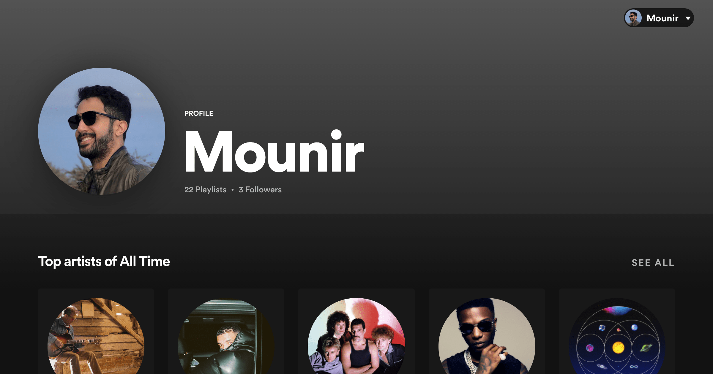

# Spotify Plus



<p align="center">
<a target="_blank" href="https://spotify-plus.herokuapp.com/"> Check it out!</a> 
</p>

>Spotify Plus is a web app clone of your spotify profile that adds additional features to help visualize personalized Spotify Data. Login with your spotify account and get extra stats like:
>- Sorting your favorite tracks by Special Audio Features like Loudness, Dancebility, Tempo, Energy & more. 
>- Filtering your top artists or top tracks by time.

## Requirements

- Spotify Account
- Node, Express, Heroku
- React, React Router, React Hooks, Styled Components

## Installation

1. Got to [Spotify Developer Dashboard](https://developer.spotify.com/dashboard/) and "Create a new App". Then add `http://localhost:8080/redirect_callback` as a Redirect URI in the app settings
2. Clone the app (or download a zip whichever you prefer)

    ```shell
     git clone git@github.com:M0unir/spotify-plus.git
    ```
3. Make sure you have [nvm](https://github.com/nvm-sh/nvm) and [yarn](https://www.yarnpkg.com/) installed globally

4. Install the node version specified in the provided <code>.nvrmc</code> file
   
    ```shell
     nvm install
    ```
5. Install project dependencies
   
    ```shell
     yarn install
    ```
6. Rename <code>.env.example</code> to <code>.env</code>, then replace <code>CLIENT_ID</code> & <code>CLIENT_SECRET</code> with your own credentials from your Spotify Dashboard.
   
7. Rename <code>client/.env.development.example</code> to <code>client/.env.development</code>
8. Run the project *(This will run both the server & the client)*
   
    ```shell
     yarn start
    ```

## Optional

### Fonts
If you have Circular Fonts (used by Spotify) you could add them to <code>public/fonts/Circular/</code>.
Then change this in <code>client/.env.development</code> or <code>client/.env.production</code>:

```shell
 REACT_APP_USE_CIRCULAR_FONTS=true
```

### Meta tags & Open Graph tags
You could either set your <code>%PUBLIC_URL%</code> in <code>client/public/index.html</code> manually or for a more dynamic approach, from the <a target="_blank" href="https://create-react-app.dev/docs/advanced-configuration/">docs</a>, set the homepage key to your published app url

```json
 {
  "homepage": "https://example.com",
 }
```
It is also possible to set <code>PUBLIC_URL</code> in your production environment or prepend it to your build command:
   
```shell
 PUBLIC_URL="https://example.com" yarn build
```

### Logging Errors for production
You can use <a href="https://sentry.io/" target="_blank">sentry.io</a> to capture errors in production
```shell
 REACT_APP_SENTRY_API_KEY="ADD_YOUR_SENTRY_API_KEY"
```